# COMS W4156 - Advanced Software Engineering

## Final Project: MusicTonic Service

 

## Public Access Point: https://music-tonic.herokuapp.com/

## Demo Client: https://mean-rice.vercel.app/

## Demo Client Repository: https://github.com/J-Rebs/Mean-Rice

### Team Members

Ryan Soeyadi [rs4163], Joseph Rebagliati [jr4162], Yuhao Dong [yd2626], Madison Thantu [mgt2143]

## 1. Documented API

### MUSIC PLATFORM SERVICES (Client type one in our proposal)

- TYPE OF REQUEST: `GET`
    - ROUTE: `/client1-rest/listUsers`
    - PURPOSE: Gets list of users
    - RETURN TYPES:
        - `List<String>` if succeeds
    - FUTURE Development: Add Client Authentication and HTTP response
- TYPE OF REQUEST: `POST`
    - ROUTE: `/client1-rest/playsong?userid={id}&songid={id}&playlistid={id}`
    - PURPOSE: Registers a song played in the analytics relation for a given user, song, and playlist
    - RETURN TYPES:
        - `201 created` if succeeds
        - `400 bad request` if fails
    - FUTURE Development: Add Client Authentication
- TYPE OF REQUEST: `PUT`
    - ROUTE: `/client1-rest/likesong?userid={id}&songid={id}`
    - PURPOSE: registers songs to a default playlist for a user, creates default playlist if it does not exist, and
      increments and returns the like count for a song.
    - RETURN TYPES:
        - `200 OK` if succeeds
        - `400 bad request` if fails
    - FUTURE Development: Add Client Authentication

### MUSIC ANALYTICS SERVICES (Client type two in our proposal)

- TYPE OF REQUEST: `GET`
    - ROUTE: `/client2-rest/top3songs`
    - PURPOSE: gets the top 3 songs by like count, and it calculates the average # of playlists that the songs occur in
      overall.
    - RETURN TYPES:
        - `200 OK` if succeeds
        - `400 bad request` if fails
    - FUTURE Development: N/A

### DATA SHARING SERVICES  (Client type three in our proposal)

- TYPE OF REQUEST: `GET`
    - ROUTE: `/client3-rest/userexport`
    - PURPOSE: provides an export of user data including the user and associated fields, the playlists the user owns,
      and all analytics entries for that user.
    - RETURN TYPES:
        - `200 OK` if succeeds
        - `400 bad request` if fails
    - FUTURE Development: N/A

## 2. Unit Tests

The routes above are tested at the controller and service layer where applicable. Tests are run using J-Unit and can be
run by executive the maven tests command in IntelliJ. Whenever our application deploys to Heroku, it builds and deploys
the Maven project with all unit tests run as well.

Future development will add higher levels of coverage for our service.

To view our tests
look [here](https://github.com/J-Rebs/friendly-couscous/tree/main/MusicTonic/src/test/java/com/example/musictonic).

## 3. Integration Tests

### Postman Tests

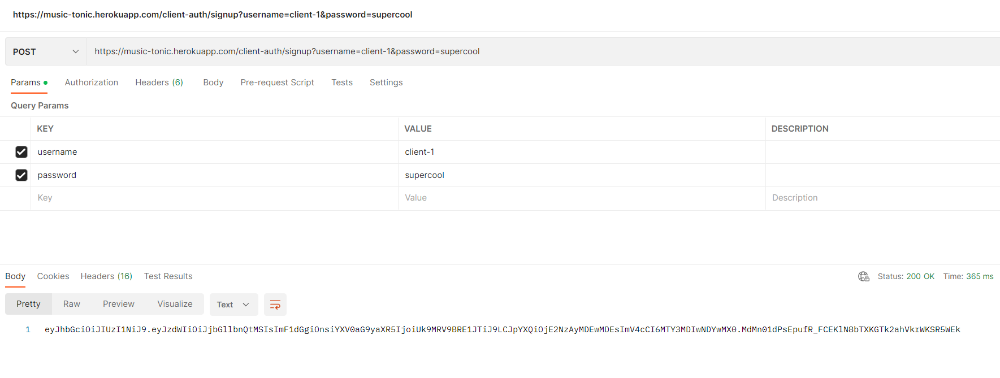

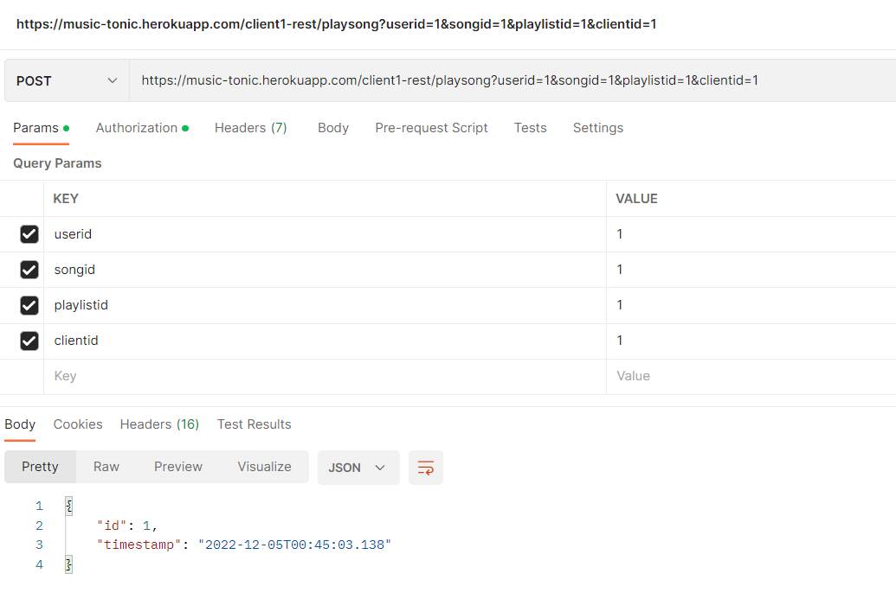

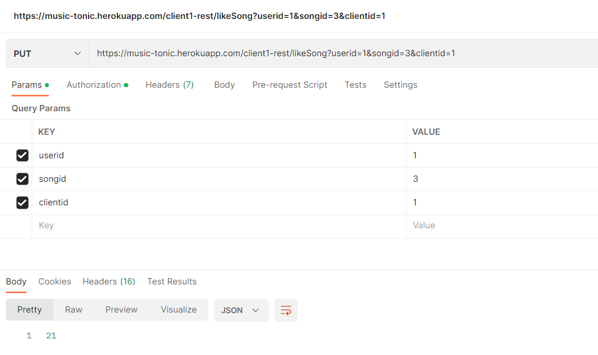

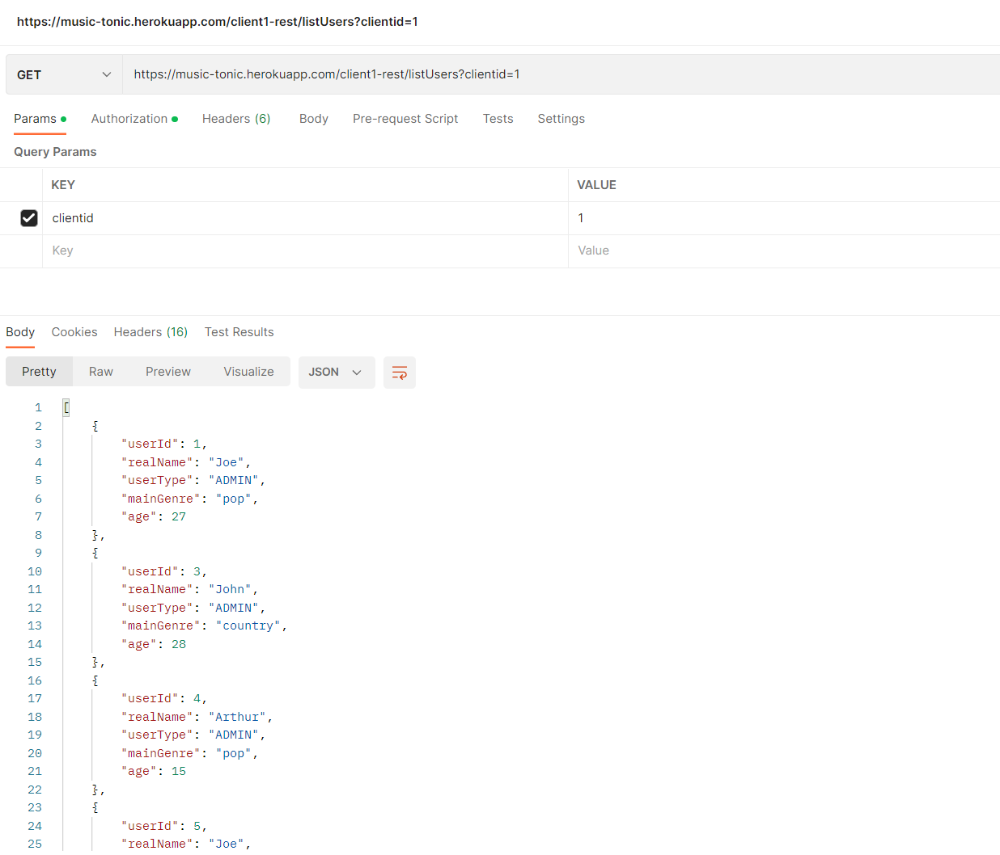

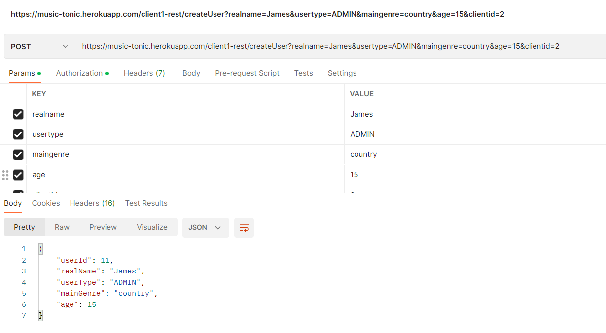

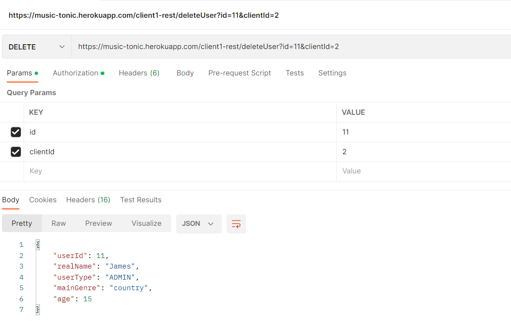

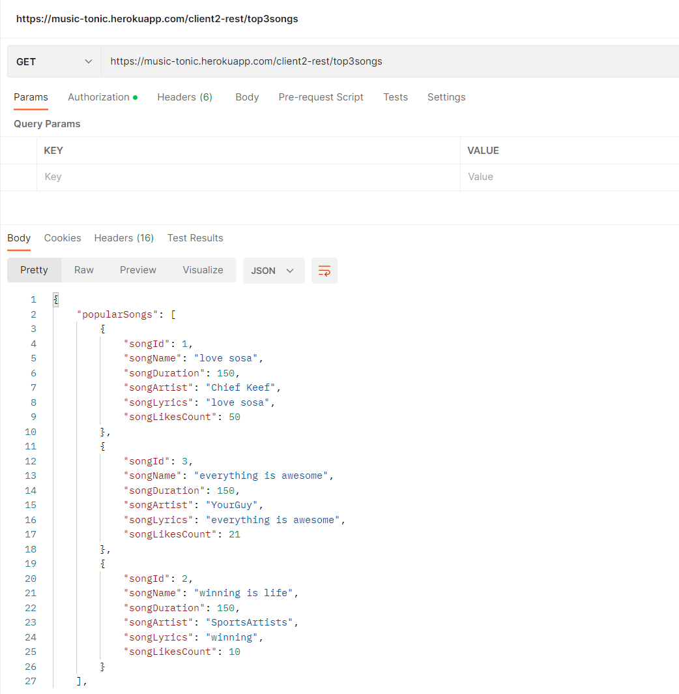

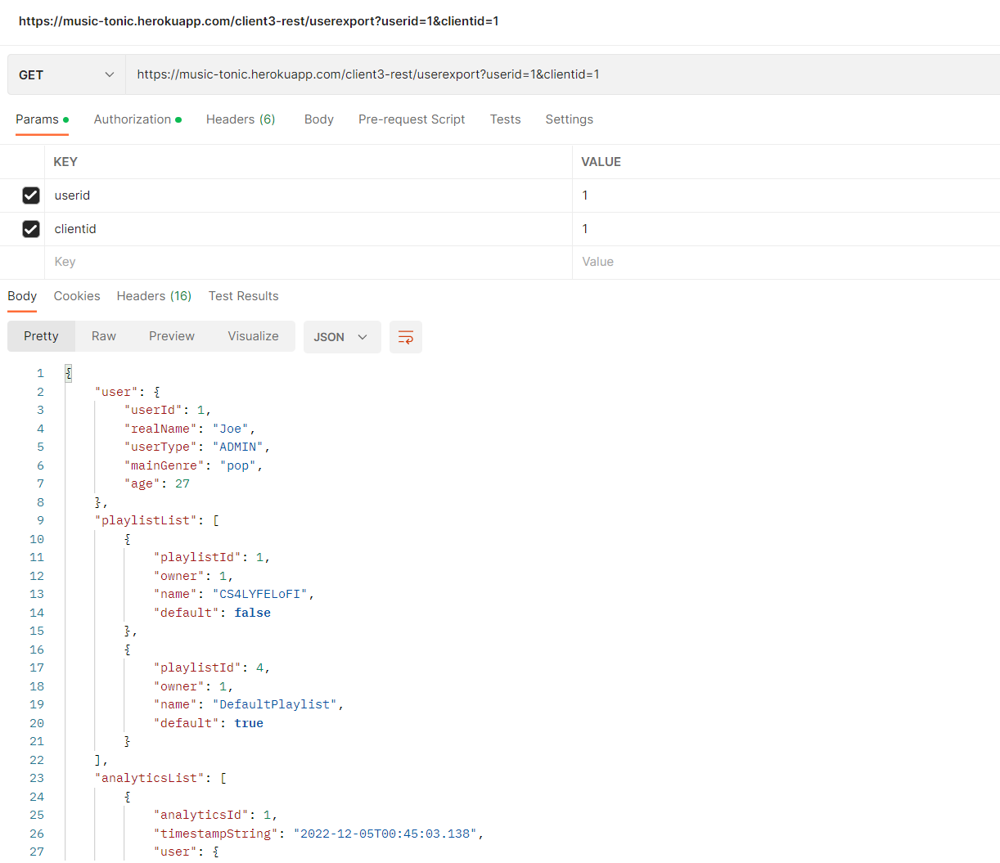

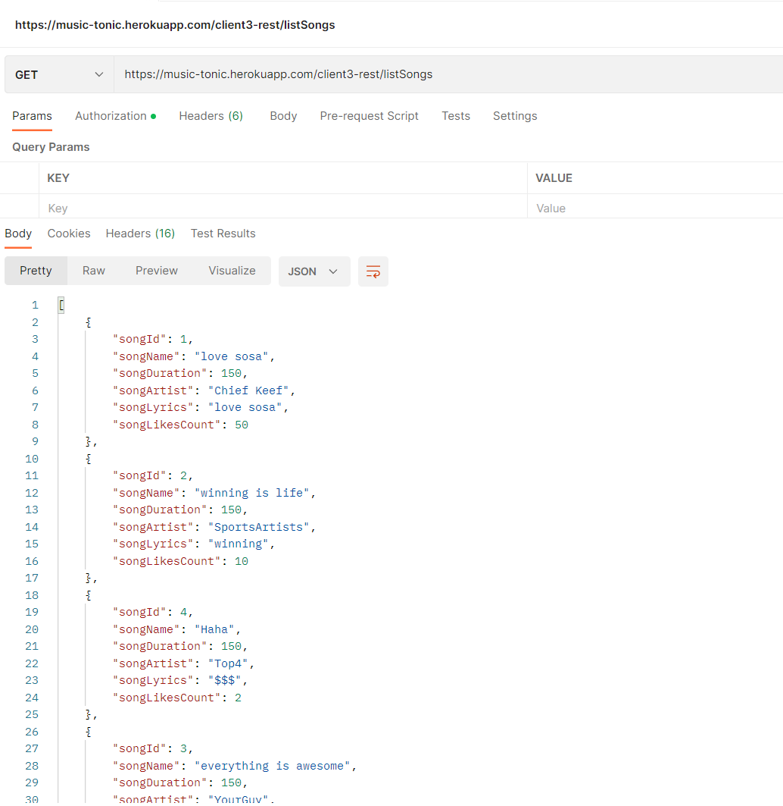

## 4. Style Compliant

See CheckStyle Report from October 30th, 2022
[here](https://htmlpreview.github.io/?https://github.com/J-Rebs/friendly-couscous/blob/main/MusicTonic/SiteReports/site%2030_October_2022/checkstyle.html)

## 5. Coverage

We use JaCoCo and [ReportGenerator](https://github.com/marketplace/actions/reportgenerator) to automate coverage
reporting as part of our Continous Integration in GitHub Actions. A full summary report available from the latest push
to this repository
is [here](https://github.com/J-Rebs/friendly-couscous/blob/main/MusicTonic/target/site/jacoco/Summary.md#summary).

Summary badges are included at the top of this repository.

## 6. Static Analysis

We use [Codacy](https://docs.codacy.com/) to run static analysis on every push as part of our repository. The quality of
our code (i.e., issues found) is shown via the code quality badge at the top of this README. To learn more about how
these grades are calculated
see [here](https://docs.codacy.com/v4.0/faq/repositories/what-are-the-different-grades-and-how-are-they-calculated/).

Our analysis is run using SpotBugs from Codacy. We test 338 rules, which is based on Codacy's standard selection for SpotBugs. We disabled one to two patterns related to [exposing internal representations](https://stackoverflow.com/questions/18954873/malicious-code-vulnerability-may-expose-internal-representation-by-incorporati), as we didn't feel these errors were substantive enough to change our overall code logic. Furthermore, it is something easy to modify in the future if further advice were given that such updates should be added. 

See a screenshot below of our dashboard that shows the number of SpotBugs rules enabled. We don't use Codacy to review report websites and related content (e.g., things in the
site folder or similar).

## 7. Build, Run, Test Instructions

To run the project, we recommend downloading IntelliJ, see [here](https://www.jetbrains.com/idea/). From here deployment
can be done by click `run` on MusicTonicApplication. This will build and run the application. Tests can be run
independently of build, but they are included in the prior instruction by default for unit testing. To run tests
independently, you can use the Maven Tool Window and run Maven Tests. Below are screenshots to show this in IntelliJ.

To run this project from the command line from a Mac, make sure that you have maven installed locally. Then, from the
terminal, run the following code:
`mvn spring-boot:run`.

### Build and Run in IntelliJ

### Test in IntelliJ

## 8. Authentication / Authorization

We implemented JWT bearer tokens based on this [example](https://github.com/murraco/spring-boot-jwt). For the most part, we copied the code, but we added some modifications based on deprecation and our business logic. Notes are included in-line. The `/client-auth/signup` route (taking as parameters username and password) will allow a client to sign up for the first time to recieve a bearer token. Post first authentication, clients can ping `/client-auth/signin` with their username and password to recieve new tokens. Tokens are set to a lifetime of one hour. We don't include the JWT related package in our coverage testing as we consider it based on standard patterns and the imported JWT / Spring Security libraries. The client's username is verified against a separate list of clients kept by MusicTonic to ensure not any client can authenticate into MusicTonic. Separation of client data post authorization is still based on manual selection of the correct ID. Future work could automate this to further improve security, but we maintain separation of client data within our routes and we implement some form of authentication as is.  

## 9. End-to-End Tests

### Test 1

1. [x] [POST] https://music-tonic.herokuapp.com/client-auth/signup?username=client-1&password=supercool
2. [x] [POST] https://music-tonic.herokuapp.com/client1-rest/playsong?userid=1&songid=1&playlistid=1&clientid=1
3. [x] [POST] https://music-tonic.herokuapp.com/client1-rest/playsong?userid=1&songid=1&playlistid=1&clientid=1
4. [x] [GET]  https://music-tonic.herokuapp.com/client3-rest/userexport?userid=1&clientid=1  
   In the above end-to-end test, we first need to register an account and get an authorization token from the registration. After getting the generated token, we need to paste it to the Auth - Bearer Token section in Postman to pass the authentication. After this step, client 1 first updated the user with userid=1 who played the song with songid=1 twice,
   and client 3 then exported this user's profile. In the screenshot below, we can see that the token has been generated, and the playsong generates two
   analytics with unique ids and timestamps, and when client 3 exports this user's profile, we can see that in the
   analyticsList part of the user's profile, the analyticsId and timestampString matched with these numbers generated
   previously.  
   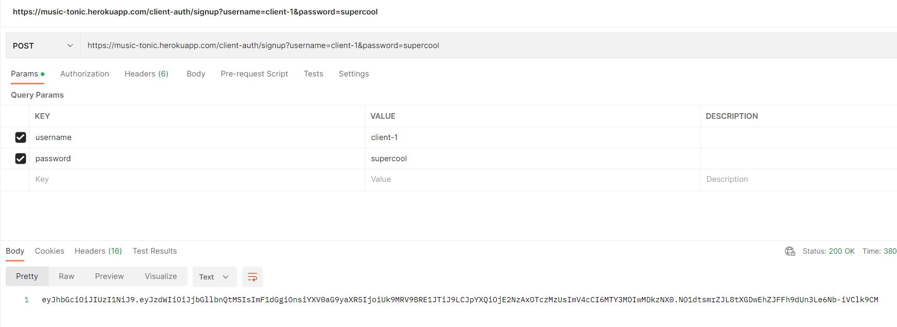
   
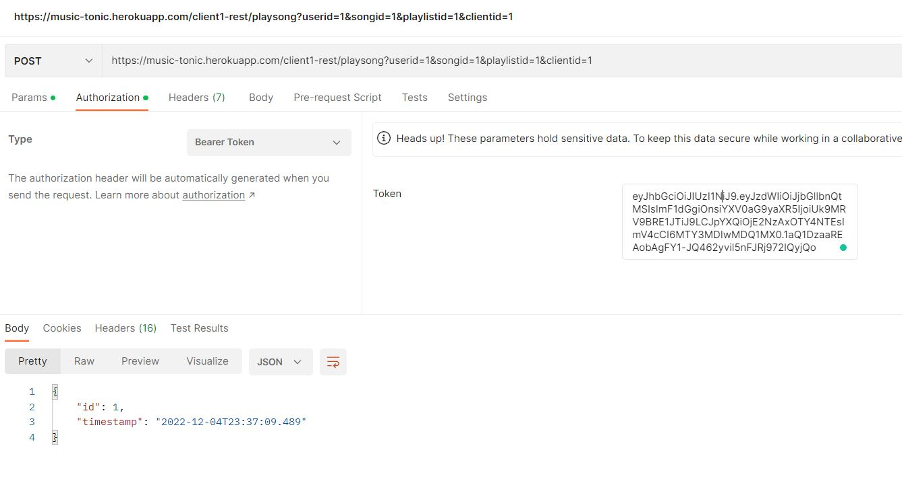
   
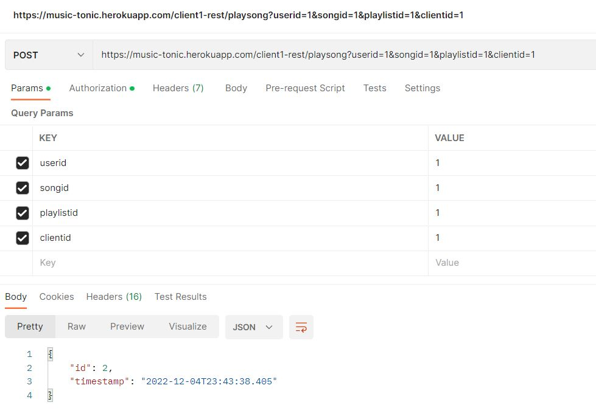
   
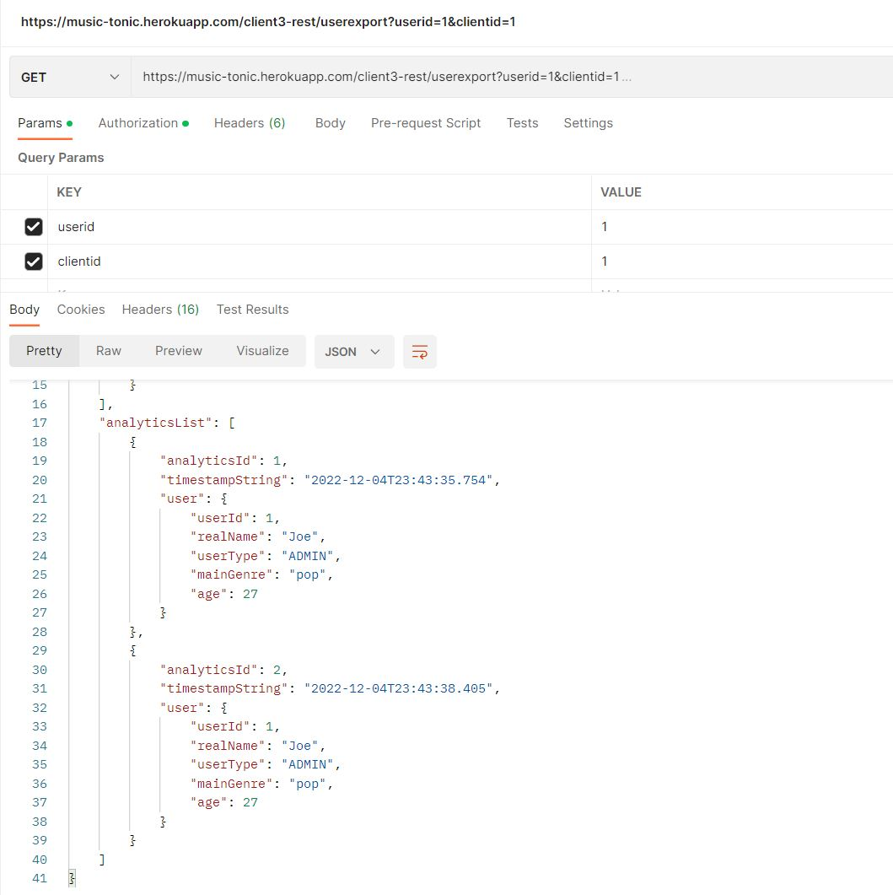

### Test 2
1. [x] [POST] https://music-tonic.herokuapp.com/client-auth/signup?username=client-2&password=supercool
2. [x] [GET] https://music-tonic.herokuapp.com/client3-rest/listSongs
3. [x] [GET] https://music-tonic.herokuapp.com/client2-rest/top3songs
4. [x] [PUT] https://music-tonic.herokuapp.com/client1-rest/likeSong?userid=1&songid=3&clientid=1
5. [x] same likeSong for 10 times
6. [x] [GET] https://music-tonic.herokuapp.com/client3-rest/listSongs
7. [x] [GET] https://music-tonic.herokuapp.com/client2-rest/top3songs  
   In the above end-to-end test, similar to Test 1, we first need to register an account and get an authorization token. After that, client 3 first requested to list all the songs, then client 2 request to list top 3
   songs. After these requests are made, client 1 called likeSong with userid=1 and songid=3 for 10 times. Then client 3 and client 2
   called listSongs and top3songs again. We can see that songLikesCount for song 3 is increased by 10 (from 21 to 31) in
   listSongs. This change is also reflected on the top3songs.  
   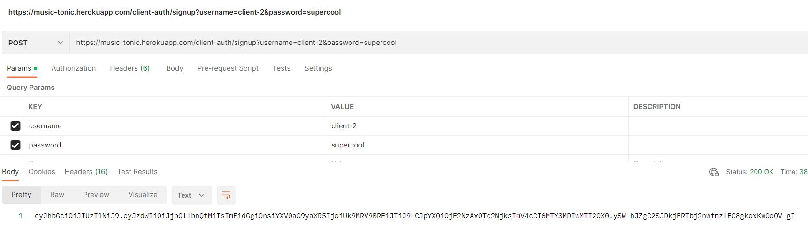
   
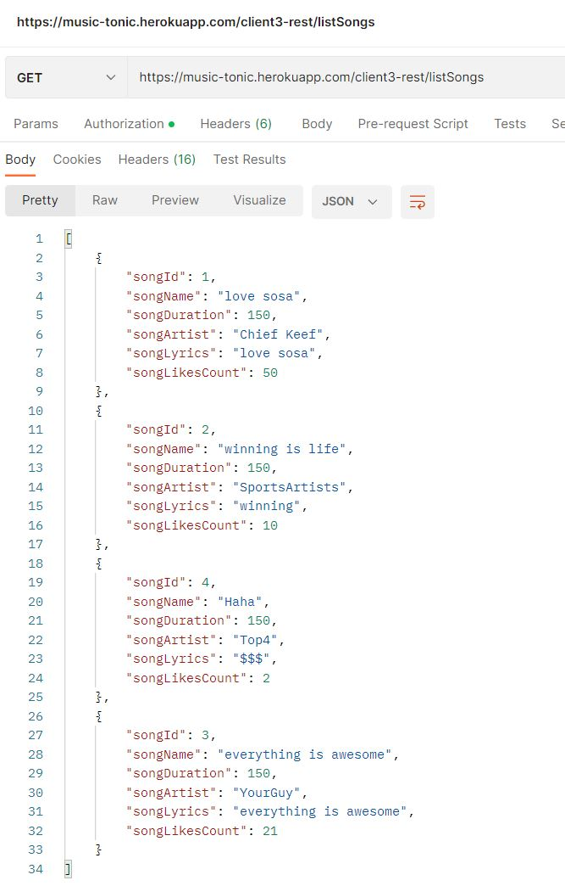
   
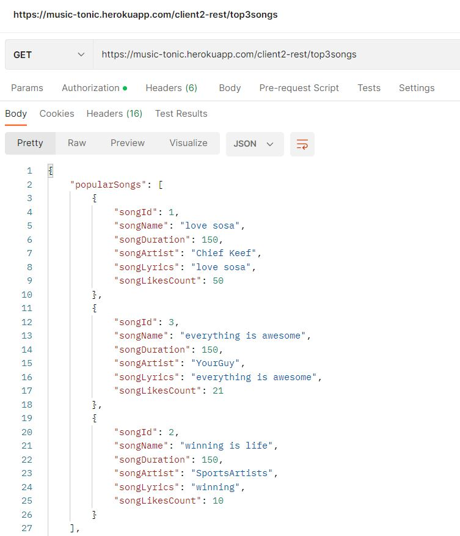
   
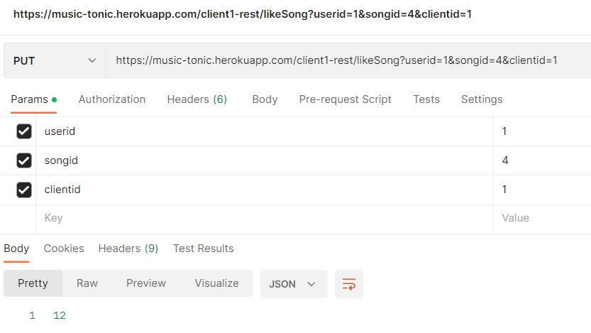
   
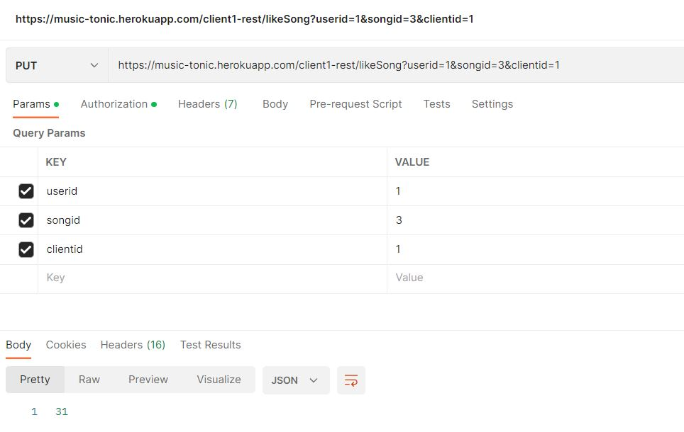
   
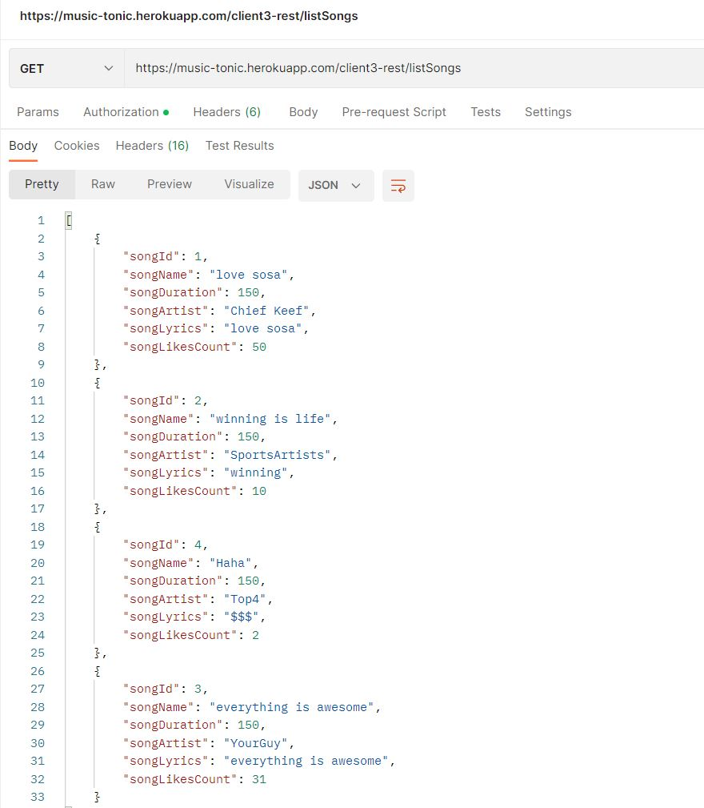
   
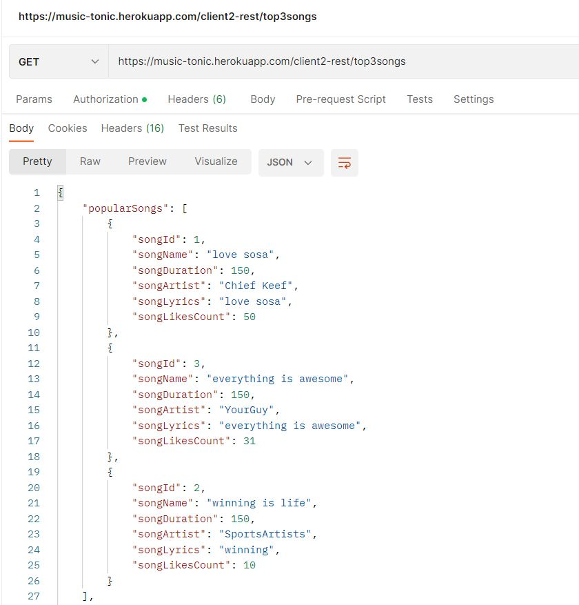

## By Team Grey Orange

  

