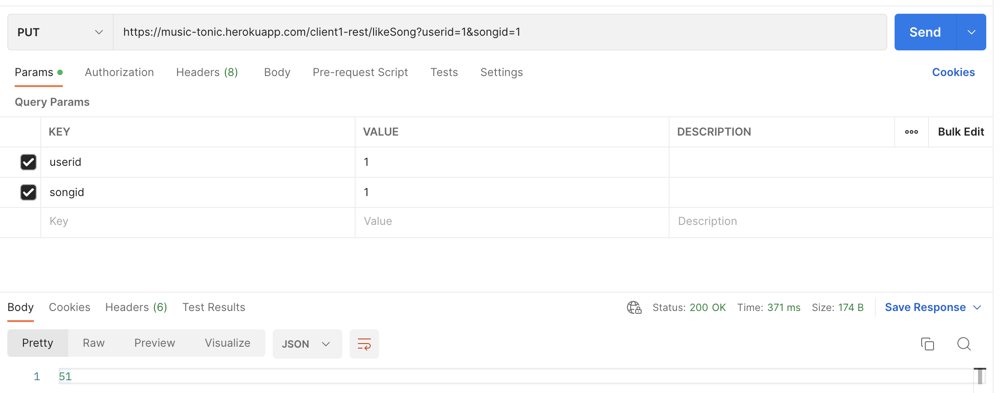
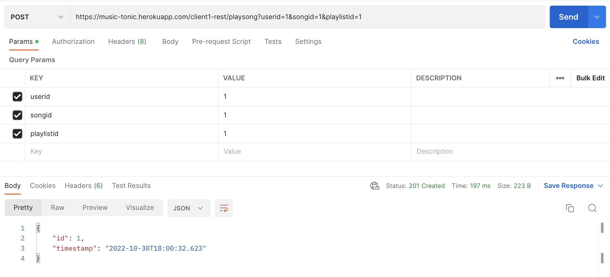
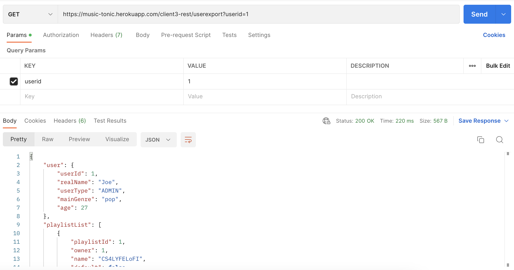
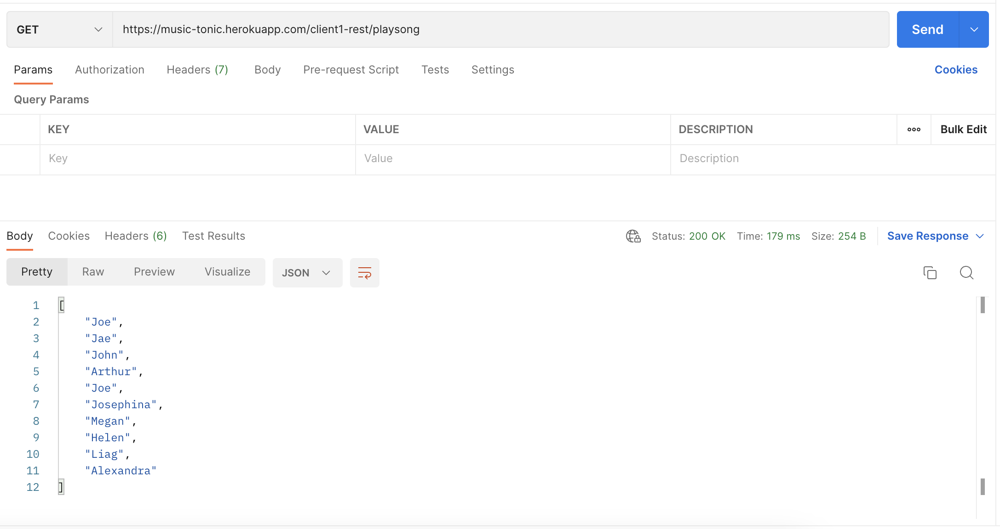
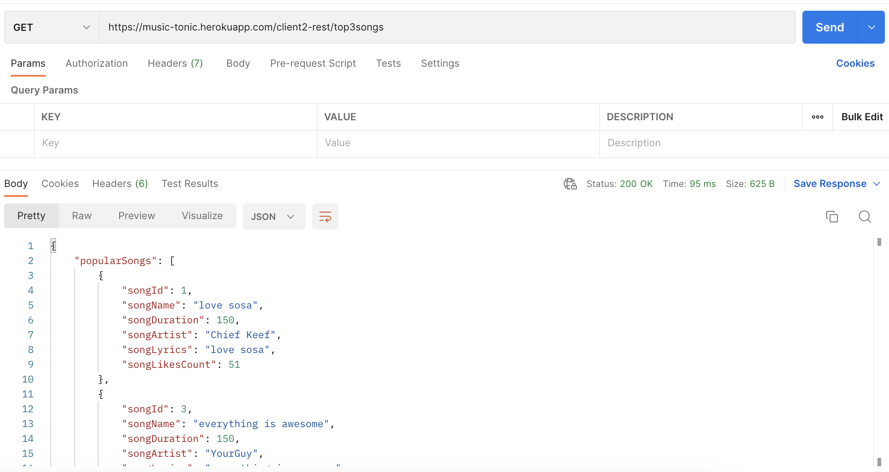

# COMS W4156 - Advanced Software Engineering

## Final Project: MusicTonic Service

## Public Access Point: https://music-tonic.herokuapp.com/

## Demo Client: https://mean-rice.vercel.app/

### Team Members

Ryan Soeyadi [rs4163], Joseph Rebagliati [jr4162], Yuhao Dong [yd2626], Madison Thantu [mgt2143]

## 1. Documented API

### MUSIC PLATFORM SERVICES (Client type one in our proposal)

- TYPE OF REQUEST: `GET`
    - ROUTE: `/client1-rest/listUsers`
    - PURPOSE: Gets list of users
    - RETURN TYPES:
        - `List<String>` if succeeds
    - FUTURE Development: Add Client Authentication and HTTP response
- TYPE OF REQUEST: `POST`
    - ROUTE: `/client1-rest/playsong?userid={id}&songid={id}&playlistid={id}`
    - PURPOSE: Registers a song played in the analytics relation for a given user, song, and playlist
    - RETURN TYPES:
        - `201 created` if succeeds
        - `400 bad request` if fails
    - FUTURE Development: Add Client Authentication
- TYPE OF REQUEST: `PUT`
    - ROUTE: `/client1-rest/likesong?userid={id}&songid={id}`
    - PURPOSE: registers songs to a default playlist for a user, creates default playlist if it does not exist, and
      increments and returns the like count for a song.
    - RETURN TYPES:
        - `200 OK` if succeeds
        - `400 bad request` if fails
    - FUTURE Development: Add Client Authentication

### MUSIC ANALYTICS SERVICES (Client type two in our proposal)

- TYPE OF REQUEST: `GET`
    - ROUTE: `/client2-rest/top3songs`
    - PURPOSE: gets the top 3 songs by like count, and it calculates the average # of playlists that the songs occur in
      overall.
    - RETURN TYPES:
        - `200 OK` if succeeds
        - `400 bad request` if fails
    - FUTURE Development: N/A

### DATA SHARING SERVICES  (Client type three in our proposal)

- TYPE OF REQUEST: `GET`
    - ROUTE: `/client3-rest/userexport`
    - PURPOSE: provides an export of user data including the user and associated fields, the playlists the user owns,
      and all analytics entries for that user.
    - RETURN TYPES:
        - `200 OK` if succeeds
        - `400 bad request` if fails
    - FUTURE Development: N/A

## 2. Unit Tests

The routes above are tested at the controller and service layer where applicable. Tests are run using J-Unit and can be
run by executive the maven tests command in IntelliJ. Whenever our application deploys to Heroku, it builds and deploys
the Maven project with all unit tests run as well.

Future development will add higher levels of coverage for our service.

To view our tests
look [here](https://github.com/J-Rebs/friendly-couscous/tree/main/MusicTonic/src/test/java/com/example/musictonic).

## 3. Integration Tests

### Postman Tests

## 4. Style Compliant

See CheckStyle Report from October 30th, 2022
[here](https://htmlpreview.github.io/?https://github.com/J-Rebs/friendly-couscous/blob/main/MusicTonic/SiteReports/site%2030_October_2022/checkstyle.html)

## 5. Build, Run, Test Instructions

To run the project, we recommend downloading IntelliJ, see [here](https://www.jetbrains.com/idea/). From here deployment
can be done by click `run` on MusicTonicApplication. This will build and run the application. Tests can be run
independently of build, but they are included in the prior instruction by default for unit testing. To run tests
independently, you can use the Maven Tool Window and run Maven Tests. Below are screenshots to show this in IntelliJ.

To run this project from the command line from a Mac, make sure that you have maven installed locally. Then, from the
terminal, run the following code:
`mvn spring-boot:run`.

### Build and Run in IntelliJ

### Test in IntelliJ

## By Team Grey Orange

  

