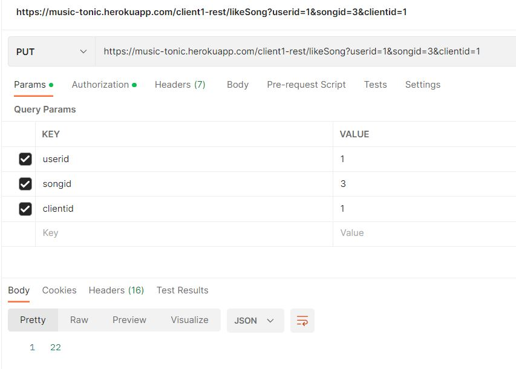

# COMS W4156 - Advanced Software Engineering

## Final Project: MusicTonic Service

 

## Public Access Point: https://music-tonic.herokuapp.com/

## Demo Client: https://mean-rice.vercel.app/

## Demo Client Repository: https://github.com/J-Rebs/Mean-Rice

### Team Members

Ryan Soeyadi [rs4163], Joseph Rebagliati [jr4162], Yuhao Dong [yd2626], Madison Thantu [mgt2143]

## 1. Documented API

### MUSIC PLATFORM SERVICES (Client type one in our proposal)

- TYPE OF REQUEST: `GET`
    - ROUTE: `/client1-rest/listUsers`
    - PURPOSE: Gets list of users
    - RETURN TYPES:
        - `List<String>` if succeeds
    - FUTURE Development: Add Client Authentication and HTTP response
- TYPE OF REQUEST: `POST`
    - ROUTE: `/client1-rest/playsong?userid={id}&songid={id}&playlistid={id}`
    - PURPOSE: Registers a song played in the analytics relation for a given user, song, and playlist
    - RETURN TYPES:
        - `201 created` if succeeds
        - `400 bad request` if fails
    - FUTURE Development: Add Client Authentication
- TYPE OF REQUEST: `PUT`
    - ROUTE: `/client1-rest/likesong?userid={id}&songid={id}`
    - PURPOSE: registers songs to a default playlist for a user, creates default playlist if it does not exist, and
      increments and returns the like count for a song.
    - RETURN TYPES:
        - `200 OK` if succeeds
        - `400 bad request` if fails
    - FUTURE Development: Add Client Authentication

### MUSIC ANALYTICS SERVICES (Client type two in our proposal)

- TYPE OF REQUEST: `GET`
    - ROUTE: `/client2-rest/top3songs`
    - PURPOSE: gets the top 3 songs by like count, and it calculates the average # of playlists that the songs occur in
      overall.
    - RETURN TYPES:
        - `200 OK` if succeeds
        - `400 bad request` if fails
    - FUTURE Development: N/A

### DATA SHARING SERVICES  (Client type three in our proposal)

- TYPE OF REQUEST: `GET`
    - ROUTE: `/client3-rest/userexport`
    - PURPOSE: provides an export of user data including the user and associated fields, the playlists the user owns,
      and all analytics entries for that user.
    - RETURN TYPES:
        - `200 OK` if succeeds
        - `400 bad request` if fails
    - FUTURE Development: N/A

## 2. Unit Tests

The routes above are tested at the controller and service layer where applicable. Tests are run using J-Unit and can be
run by executive the maven tests command in IntelliJ. Whenever our application deploys to Heroku, it builds and deploys
the Maven project with all unit tests run as well.

Future development will add higher levels of coverage for our service.

To view our tests
look [here](https://github.com/J-Rebs/friendly-couscous/tree/main/MusicTonic/src/test/java/com/example/musictonic).

## 3. Integration Tests

### Postman Tests

## 4. Style Compliant

See CheckStyle Report from October 30th, 2022
[here](https://htmlpreview.github.io/?https://github.com/J-Rebs/friendly-couscous/blob/main/MusicTonic/SiteReports/site%2030_October_2022/checkstyle.html)

## 5. Coverage

We use JaCoCo and [ReportGenerator](https://github.com/marketplace/actions/reportgenerator) to automate coverage
reporting as part of our Continous Integration in GitHub Actions. A full summary report available from the latest push
to this repository
is [here](https://github.com/J-Rebs/friendly-couscous/blob/main/MusicTonic/target/site/jacoco/Summary.md#summary).

Summary badges are included at the top of this repository.

## 6. Static Analysis

We use [Codacy](https://docs.codacy.com/) to run static analysis on every push as part of our repository. The quality of
our code (i.e., issues found) is shown via the code quality badge at the top of this ReadMe. To learn more about how
these grades are calculated
see [here](https://docs.codacy.com/v4.0/faq/repositories/what-are-the-different-grades-and-how-are-they-calculated/).

Our analysis is run using the SpotBugs standard pattern selection from Codacy. See a screenshot below of our dashboard
that shows this election. We don't use Codacy to run style checks or coverage checks, and those are covered in earlier
sections of this README. We also don't use Codacy to review report websites and related content (e.g., things in the
site folder or similar).

## 7. Build, Run, Test Instructions

To run the project, we recommend downloading IntelliJ, see [here](https://www.jetbrains.com/idea/). From here deployment
can be done by click `run` on MusicTonicApplication. This will build and run the application. Tests can be run
independently of build, but they are included in the prior instruction by default for unit testing. To run tests
independently, you can use the Maven Tool Window and run Maven Tests. Below are screenshots to show this in IntelliJ.

To run this project from the command line from a Mac, make sure that you have maven installed locally. Then, from the
terminal, run the following code:
`mvn spring-boot:run`.

### Build and Run in IntelliJ

### Test in IntelliJ

## 8. End-to-End Tests

### Test 1

1. [x] [POST] https://music-tonic.herokuapp.com/client1-rest/playsong?userid=1&songid=1&playlistid=1&clientid=1
2. [x] [POST] https://music-tonic.herokuapp.com/client1-rest/playsong?userid=1&songid=1&playlistid=1&clientid=1
3. [x] [GET]  https://music-tonic.herokuapp.com/client3-rest/userexport?userid=1&clientid=1  
   In the above end-to-end test, client 1 first updated the user with userid=1 who played the song with songid=1 twice,
   and then client 3 then exported this user's profile. In the screenshot below, we can see that playsong generates two
   analytics with unique ids and timestamps, and when client 3 exports this user's profile, we can see that in the
   analyticsList part of the user's profile, the analyticsId and timestampString matched with these numbers generated
   previously.  
   
   
   

### Test 2

1. [x] [GET] https://music-tonic.herokuapp.com/client3-rest/listSongs
2. [x] [GET] https://music-tonic.herokuapp.com/client2-rest/top3songs
3. [x] [PUT] https://music-tonic.herokuapp.com/client1-rest/likeSong?userid=1&songid=4&clientid=1
4. [x] same likeSong for 10 times
5. [x] [GET] https://music-tonic.herokuapp.com/client3-rest/listSongs
6. [x] [GET] https://music-tonic.herokuapp.com/client2-rest/top3songs
   In the above end-to-end test, client 3 first requested to list all the songs, then client 2 request to list top 3
   songs. After that, client 1 called likeSong with userid=1 and songid=4 for 10 times. Then client 3 and client 2
   called listSongs and top3songs again. We can see that songLikesCount for song 4 is increased by 10 (from 2 to 12) in
   listSongs, and song 4 (12 likes) surpasses song 2 (10 likes) and becomes top 3 songs. It matches with the result we
   got.  
   
   
   
   
   
   

## By Team Grey Orange

  

